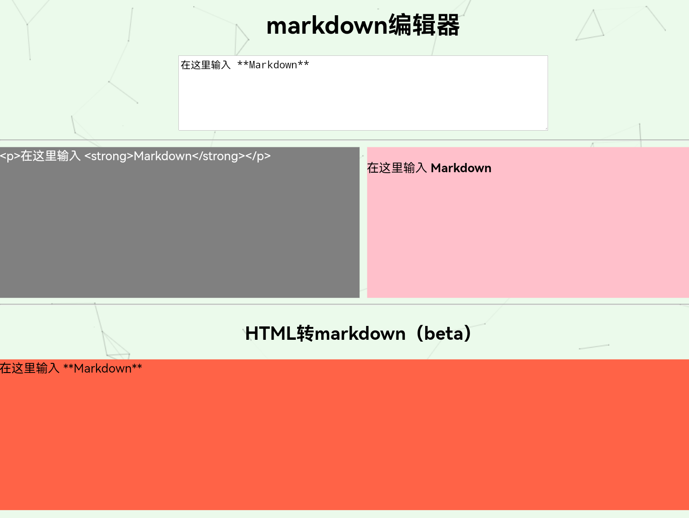

# markdown编辑器

#### 介绍
轻量级的markdown编辑器

#### 软件架构
界面简洁，基于markdown.js和html2md.js

#### 安装教程

1.  下载发行版
2.  解压到网站服务器/虚拟主机
3.  访问`index.html`，开始使用

#### 使用说明

1.  在输入框里输入markdown/html
2.  灰色区域是markdown对应的html代码
3.  粉色区域是效果预览
4.  html转markdown是测试功能，可能会出现bug
5.  橙色区域是html转markdown后的结果

#### 参与贡献

1.  Fork 本仓库
2.  新建 Feat_xxx 分支
3.  提交代码
4.  新建 Pull Request

#### 贡献人员

1.  技术云（开发者）

#### 使用的框架

1. markdown.js框架，用于markdown转html功能
2. html2md.js框架，用于html转markdown，原仓库地址：https://github.com/kohunglee/html2md

感谢以上框架的开发者！